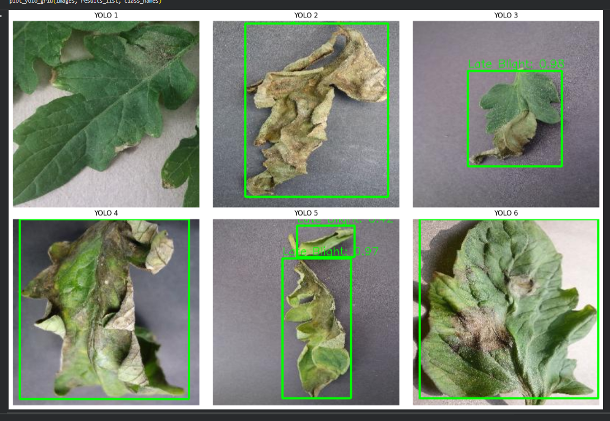
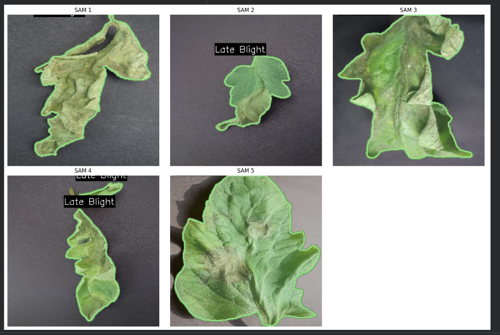
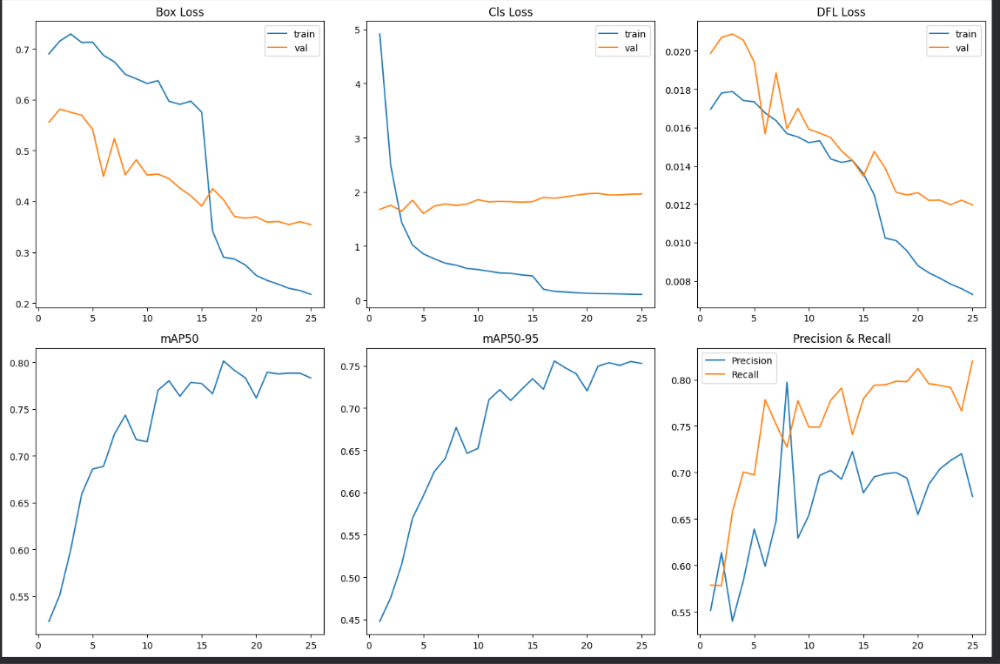

<h1 align="center">🍅 Tomato Leaf Disease Segmentation</h1>
<h3 align="center">Using YOLO26 for Detection & SAM2 for Precise Segmentation</h3>

<p align="center">
  
  
  
  
  
  
</p>

---

## 📋 Table of Contents

- [Overview](#-overview)
- [Demo & Outputs](#-demo--outputs)
- [Architecture & Pipeline](#-architecture--pipeline)
- [Dataset](#-dataset)
- [Model Details](#-model-details)
- [Training Configuration](#-training-configuration)
- [Performance Metrics](#-performance-metrics)
- [Project Structure](#-project-structure)
- [Getting Started](#-getting-started)
- [How It Works](#-how-it-works)
- [Technologies Used](#-technologies-used)
- [Results Summary](#-results-summary)
- [License](#-license)
- [Author](#-author)

---

## 🔍 Overview

This project presents a **two-stage deep learning pipeline** for automated **tomato leaf disease detection and pixel-level segmentation**. It combines the speed and accuracy of **YOLO26** (You Only Look Once v2.6) for bounding-box-based disease localization with the powerful **SAM2** (Segment Anything Model 2 by Meta AI) for generating precise instance-level segmentation masks over the diseased regions.

The system is capable of:
- **Detecting** multiple tomato leaf diseases from a single image
- **Classifying** the type of disease with confidence scores
- **Segmenting** exact pixel-level boundaries of each diseased region
- **Visualizing** results with colored overlaid masks and contour outlines

This pipeline is particularly useful for **precision agriculture**, enabling farmers and agronomists to monitor plant health at scale with minimal manual effort.

---

## 🖼️ Demo & Outputs

### YOLO26 Detection Output
> Bounding boxes drawn around detected disease regions with class labels and confidence scores.



---

### SAM2 Segmentation Output
> Pixel-level segmentation masks generated using SAM2, prompted by YOLO26 bounding boxes.



---

### Training Performance Graph
> Training & validation loss curves along with mAP50, mAP50-95, Precision, and Recall over 25 epochs.



---

## 🏗️ Architecture & Pipeline

```
Input Image
     │
     ▼
┌─────────────────────┐
│   YOLO26 Detector   │  ← Trained on Roboflow Tomato Leaf Dataset (v7, yolo26 format)
│  (yolo26n backbone) │
└─────────────────────┘
     │
     │  Bounding Boxes + Class Labels + Confidence
     ▼
┌─────────────────────┐
│   SAM2 Segmentor    │  ← Meta's Segment Anything Model 2 (sam2_b.pt)
│   (Box-prompted)    │
└─────────────────────┘
     │
     │  Instance Segmentation Masks
     ▼
┌─────────────────────────────────────┐
│  Overlay Visualization              │
│  (Colored Masks + Contours + Labels)│
└─────────────────────────────────────┘
```

The two models work in tandem:
1. **YOLO26** runs first — it scans the full image and outputs bounding boxes with disease class predictions.
2. **SAM2** receives those boxes as spatial prompts and generates fine-grained segmentation masks within each box region.

This approach leverages YOLO's speed and class-awareness alongside SAM2's superior boundary delineation capability.

---

## 📦 Dataset

| Property        | Details |
|----------------|---------|
| **Source**      | [Roboflow Universe](https://universe.roboflow.com/) |
| **Workspace**   | `test-8` |
| **Project**     | `tomato-leaf-disease-pubio` |
| **Version**     | 7 |
| **Format**      | YOLO26 |
| **Image Size**  | 640 × 640 |
| **Splits**      | Train / Validation / Test |

The dataset contains annotated images of tomato leaves affected by various diseases. Each image is labeled with bounding boxes and class names corresponding to specific disease types.

**To download the dataset programmatically:**
```python
from roboflow import Roboflow

rf = Roboflow(api_key="YOUR_API_KEY")
project = rf.workspace("test-8").project("tomato-leaf-disease-pubio")
version = project.version(7)
dataset = version.download("yolo26")
```

---

## 🤖 Model Details

### YOLO26 (Detection)
| Parameter       | Value |
|----------------|-------|
| **Architecture** | YOLOv2.6n (nano variant) |
| **Backbone**    | CSPDarknet (nano) |
| **Input Size**  | 640 × 640 |
| **Framework**   | Ultralytics |
| **Weights File**| `models/best.pt` |

### SAM2 (Segmentation)
| Parameter       | Value |
|----------------|-------|
| **Architecture** | Segment Anything Model 2 (Base) |
| **Developer**   | Meta AI |
| **Prompt Type** | Bounding Box (from YOLO output) |
| **Weights File**| `sam2_b.pt` |

---

## ⚙️ Training Configuration

```yaml
Model:       yolo26n.pt
Epochs:      25
Image Size:  640
Device:      GPU (CUDA)
Batch Size:  auto
Optimizer:   AdamW (default)
Platform:    Google Colab (T4 GPU)
```

Training includes:
- Automatic learning rate scheduling
- Best weights saved via early stopping criteria (`best.pt`)
- Final epoch weights saved as `last.pt`
- Metrics tracked: `box_loss`, `cls_loss`, `dfl_loss`, `mAP50`, `mAP50-95`, `Precision`, `Recall`

---

## 📊 Performance Metrics

Training results are tracked across 25 epochs. The following metrics are plotted:

| Metric           | Description |
|-----------------|-------------|
| `Box Loss`       | Bounding box regression loss (train & val) |
| `Cls Loss`       | Classification loss (train & val) |
| `DFL Loss`       | Distribution Focal Loss for box regression (train & val) |
| `mAP@50`         | Mean Average Precision at IoU = 0.50 |
| `mAP@50-95`      | Mean Average Precision averaged over IoU = 0.50 to 0.95 |
| `Precision`      | Ratio of correct positive detections |
| `Recall`         | Ratio of actual positives correctly detected |

> See [training_graph.png](example_outputs/training_graph.png) for full visual curves.

---

## 📁 Project Structure

```
Leaf Disease Detection YOLO26 and SAM2/
│
├── 📓 notebook/
│   └── leaf_disease_seg_yolo26_sam_.ipynb   # Main Jupyter Notebook (Colab)
│
├── 🤖 models/
│   ├── best.pt                              # Best trained YOLO26 weights
│   └── last.pt                             # Last epoch YOLO26 weights
│
├── 🖼️ example_outputs/
│   ├── yolo26_sample.png                    # YOLO26 detection visualization
│   ├── segment.png                          # SAM2 segmentation visualization
│   └── training_graph.png                  # Training metrics plot
│
├── ⚙️ sam2_b.pt                             # SAM2 base model weights
│
└── 📄 README.md                             # Project documentation
```

---

## 🚀 Getting Started

### Prerequisites

```bash
pip install ultralytics
pip install roboflow
pip install opencv-python
pip install matplotlib
pip install pyyaml
pip install pandas
```

Or install all at once:
```bash
pip install ultralytics roboflow opencv-python matplotlib pyyaml pandas
```

### Running on Google Colab (Recommended)

1. **Open the notebook** in Google Colab:
   - Upload `notebook/leaf_disease_seg_yolo26_sam_.ipynb` to Colab, or open via GitHub.

2. **Mount Google Drive** (Cell 1 — for model/data persistence across sessions).

3. **Run cells sequentially** (Cell 1 through Cell 12):
   - The notebook auto-downloads the dataset if not already cached.
   - Skips retraining if `best.pt` is already in Drive.
   - Loads SAM2 weights from Drive if available.

4. **Results** are automatically saved to:
   ```
   /content/drive/MyDrive/tomato_leaf_model/example_outputs/
   ```

### Running Inference Locally

```python
from ultralytics import YOLO, SAM

# Load trained YOLO model
yolo_model = YOLO("models/best.pt")

# Load SAM2 model
sam_model = SAM("sam2_b.pt")

# Run YOLO inference
results = yolo_model("path/to/your/image.jpg", verbose=False)
boxes = results[0].boxes.xyxy.cpu().numpy()

# Run SAM2 segmentation using YOLO boxes as prompts
sam_results = sam_model("path/to/your/image.jpg", bboxes=boxes, verbose=False)
sam_results[0].show()  # Display result
```

---

## 🔬 How It Works

### Step-by-Step Pipeline

| Step | Description |
|------|-------------|
| **1. Dataset Download** | Dataset fetched from Roboflow in YOLO26 format with train/val/test splits. |
| **2. Data Config**      | `data.yaml` paths are automatically updated to match the Colab file system. |
| **3. YOLO Training**    | `yolo26n.pt` is fine-tuned for 25 epochs on the tomato disease dataset. |
| **4. Training Graphs**  | Loss and metric curves are plotted from `results.csv`. |
| **5. SAM2 Loading**     | SAM2 base model (`sam2_b.pt`) is loaded (cached from Drive after first run). |
| **6. YOLO Inference**   | First 6 validation images are passed through the trained YOLO model. |
| **7. SAM Segmentation** | YOLO bounding boxes are used as spatial prompts to SAM2 for mask generation. |
| **8. Visualization**    | Colored semi-transparent masks + contour outlines rendered on original images. |
| **9. Save Outputs**     | Detection and segmentation results saved as PNG files to Drive. |
| **10. Evaluation**      | Final model metrics evaluated on test/validation split. |

### Visualization Details

- Masks are rendered with **semi-transparent colored fills** (30% opacity)
- Disease region **contour outlines** are drawn with the same class color
- **Class name labels** appear with a black background box above each detection
- Colors are assigned per class using the **`tab20` colormap** for visual clarity

---

## 🛠️ Technologies Used

| Technology | Purpose |
|-----------|---------|
| **Python 3.10+** | Core programming language |
| **Ultralytics YOLO26** | Object detection & bounding box prediction |
| **Meta SAM2** | Instance-level segmentation via box prompts |
| **Roboflow** | Dataset management & annotation platform |
| **OpenCV** | Image processing, mask rendering, contour drawing |
| **Matplotlib** | Training graph visualization & image display |
| **PyYAML** | Dataset configuration file handling |
| **Pandas** | Training results CSV parsing |
| **Google Colab** | Cloud GPU training environment |
| **Google Drive** | Model & dataset persistence across sessions |

---

## 📈 Results Summary

- ✅ Trained YOLO26n model fine-tuned on tomato leaf disease dataset (25 epochs)
- ✅ Pixel-level disease masks generated using SAM2 box-prompted segmentation
- ✅ Class labels from YOLO correctly transferred to SAM2 segmentation outputs
- ✅ Multi-class disease visualization with distinct per-class color coding
- ✅ All assets (models, outputs, graphs) persisted to Google Drive for reuse

---

## 📜 License

This project is licensed under the **MIT License** — see the [LICENSE](LICENSE) file for details.

---

## 👤 Author

**Raiyan Khan**

- GitHub: [@Raiyankhan640](https://github.com/Raiyankhan640)
- Project Repository: [Tomato-Leaf-Disease-Segmentation-using-YOLO26-and-SAM2](https://github.com/Raiyankhan640/Tomato-Leaf-Disease-Segmentation-using-YOLO26-and-SAM2)

---

<p align="center">
  <i>If this project helped you, please consider giving it a ⭐ on GitHub!</i>
</p>
